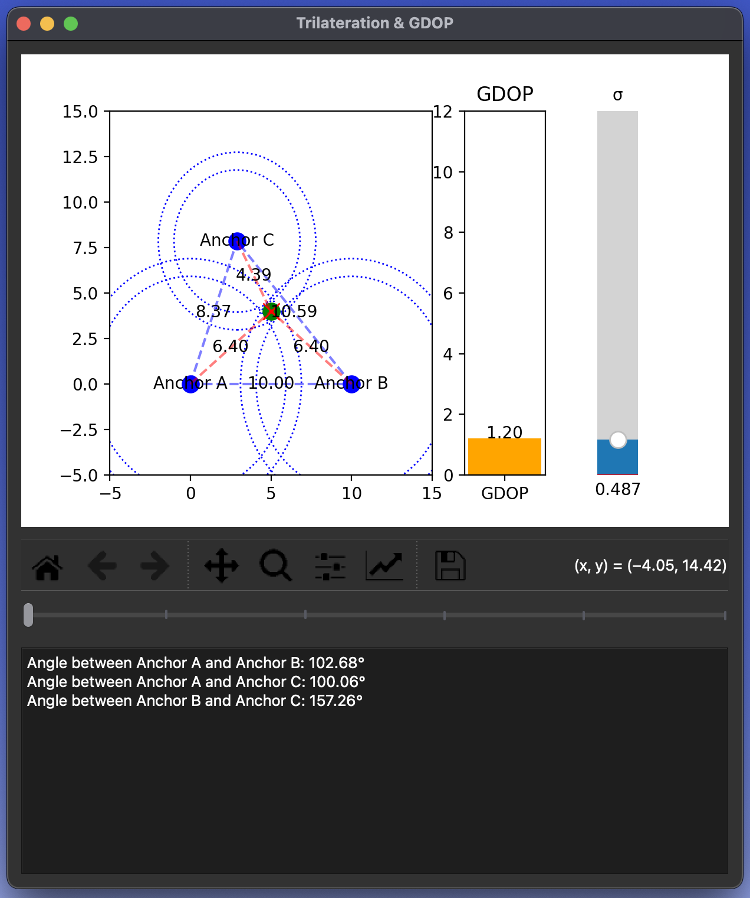

# Real-Time GDOP Calculation and Visualization

This project is a Python-based tool designed for real-time calculation and visualization of Geometric Dilution of Precision (GDOP). It features interactive manipulation of anchor positions, dynamic GDOP updates, and visualization of 2D geometric relationships. The tool is ideal for analyzing localization algorithms and understanding the impact of anchor geometry on positioning accuracy.



## How to Run

1. **Clone the repository:**
    ```bash
    git clone https://github.com/schwarzfelix/gdop.git
    cd gdop
    ```

**Optional:** Create and activate a virtual environment:
    ```bash
    python3 -m venv env
    source env/bin/activate  

    # On Windows
    env\Scripts\activate
    ```

2. **Install the required dependencies:**
    ```bash
    pip install -r requirements.txt
    ```

3. **Start the tool:**
    ```bash
    python app.py
    ```

